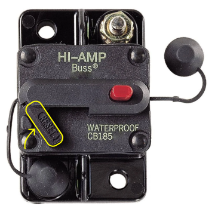
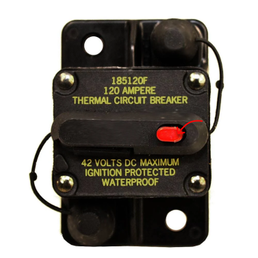

# Starting The Robot
If you changed code, see [Editing and Deploying Code](editing-code.md)
## Turning On The Robot
1. Get the robot that you are trying to launch. Also get a battery (2023 ones).
2. Plug the battery into the robot and push the switch, highlighted in yellow in the image below, to turn on the robot.
3. Connect to the internet needed for the robot you are trying to start. See that robots docs to find the internet name. 

## Running Code
1. If you are reading this, you probably already got a computer with the code on it. If not, find either CC1, CC2, or the other Dell laptop (not CAD laptop).
2. Get the controllers listed in the robot's Controller Bindings page (docs.longmetal.org) and plug it into one of the USB slots in the computer.
3. If it isn't already open, open Driver Station from the Windows Start Menu. You can look this up by pressing the Windows button in the buttom right. 
4. Open the :material-steering: tab within the driver station. Within that tab there should be an Enable and Disable switch. When enabled, the robot can move, and vice versa for when it's disabled. 
5. After making sure no one is nearby, press enable. The robot code is now enabled and the robot can move.
!!! warning
    Sometimes the controller will recognize inputs but not move the robot after enabling the code. One reason for this is that Driverstation may be configured with the wrong USB slot for the controller. To check, navigate to the :material-usb: tab in Driverstation. Within there, make sure your controller (the one flashing green after you press a button) is in the correct slot documented in the robot's Controller Bindings page. The icon of the controller currently plugged in will be green, drag this to the position specified in the docs for the robot you are trying to run. 

## Turning Off the Robot
1. In the code, press disable to turn off the code, so you won't get hurt while turning off the robot.
2. Press the red button on the robot's breaker to turn it off. This cuts all power to the robot, so it is safe to interact with any normally powered mechanisms.

